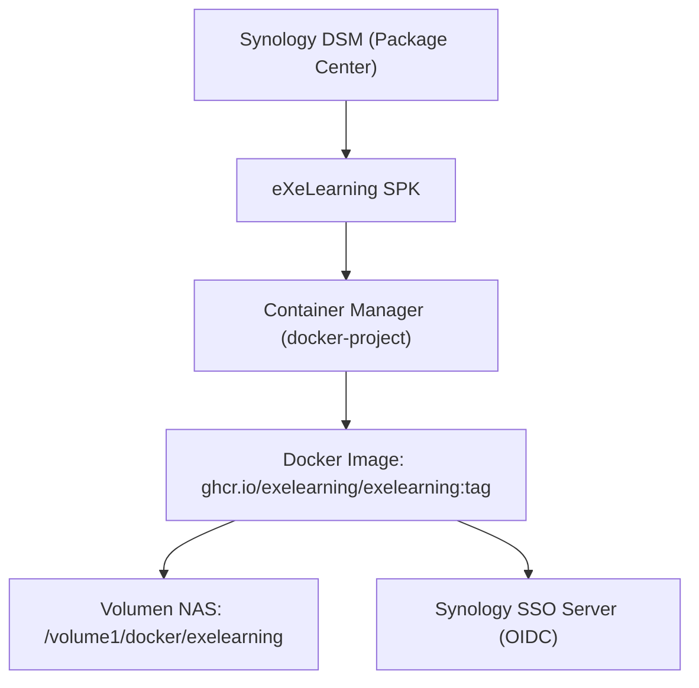
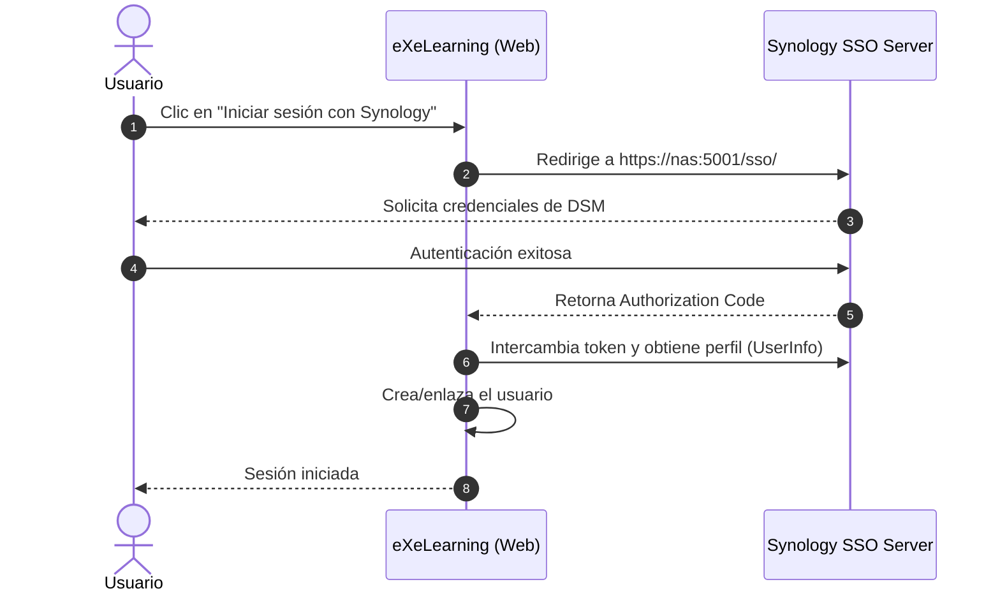

# Despliegue en Synology NAS (SPK / Container Manager)

eXeLearning se puede instalar y ejecutar en servidores NAS de Synology mediante un paquete oficial **SPK (Synology Package)** ligero que aprovecha el recurso nativo `docker-project` de **Container Manager** (DSM 7.2.1+).

---

## 1. Arquitectura del Paquete

El SPK actúa como un envoltorio nativo que se integra con DSM:



- **Tamaño ligero:** El SPK pesa ~100 KB (solo metadatos, asistentes de interfaz y scripts de ciclo de vida).
- **Imagen oficial multiarquitectura:** Descarga automáticamente la imagen oficial optimizada para `linux/amd64` (Intel/AMD) o `linux/arm64` (ARMv8).
- **Persistencia garantizada:** Los datos, base de datos SQLite y assets se almacenan en una carpeta compartida del NAS (`/volume1/docker/exelearning` por defecto).

---

## 2. Requisitos Previos

- **Sistema operativo:** Synology DSM **7.2.1-69057** o superior.
- **Paquetes requeridos:** **Container Manager** (versión 1432 o superior), disponible de forma gratuita en el Package Center.
- **Arquitectura de CPU:** Modelos Synology con procesador **x86_64** (Intel/AMD) o **ARM64** (Realtek RTD1619b, etc. compatibles con Docker).

---

## 3. Instalación

### Opción A: Instalación manual del archivo `.spk`

1. Descarga el archivo `exelearning-<version>.spk` desde los [Releases oficiales de GitHub](https://github.com/exelearning/exelearning/releases).
2. Entra en el panel de control de tu Synology DSM y abre **Package Center** (Centro de paquetes).
3. Haz clic en el botón superior **Instalación manual** (Manual Install) y selecciona el archivo `.spk`.
4. El asistente de instalación solicitará:
   - **Puerto web:** Puerto local del NAS para eXeLearning (por defecto `8080`).
   - **Ruta de datos:** Carpeta en el NAS donde se guardarán proyectos y configuraciones (por defecto `/volume1/docker/exelearning`).
   - **Método de autenticación:** Modo inicial (`password,guest`, `password`, `openid,password`, o `none`).
5. Confirma la instalación. Container Manager descargará la imagen y levantará el servicio automáticamente.

---

### Opción B: Repositorio de paquetes (Package Center)

1. En **Package Center**, pulsa en **Configuración** -> pestaña **Orígenes de paquetes** (Package Sources).
2. Añade un nuevo origen:
   - **Nombre:** `eXeLearning`
   - **Ubicación:** `https://synology.exelearning.net/` (o la URL de GitHub Pages configurada)
3. Ve a la sección **Comunidad** en el Package Center y haz clic en **Instalar** en eXeLearning.

---

## 4. Federación de Login con Synology SSO (OpenID Connect)

Es posible permitir que los usuarios de tu Synology NAS inicien sesión en eXeLearning utilizando sus credenciales de DSM (locales o de Directorio LDAP/Active Directory).



### Paso 1: Instalar Synology SSO Server
1. En el **Package Center** de DSM, busca e instala **SSO Server**.
2. Abre **SSO Server** y en **Servicio** activa la casilla **Habilitar el servicio OIDC**.

### Paso 2: Registrar la aplicación eXeLearning
1. Dentro de **SSO Server**, dirígete a **Lista de aplicaciones** -> **Añadir**.
2. Completa los datos:
   - **Nombre de la aplicación:** `eXeLearning`
   - **URI de redirección:** `https://<ip-o-dominio-del-nas>:<puerto>/login/openid/callback`  
     *(ejemplo: `https://nas.local:8080/login/openid/callback` o la URL configurada en el proxy inverso)*
3. Guarda y copia el **ID de cliente** (App ID) y el **Secreto de cliente** (App Secret).

### Paso 3: Configurar eXeLearning
Edita el archivo `.env` ubicado en la carpeta de instalación del paquete (`/var/packages/exelearning/target/.env` o en el proyecto de Container Manager):

```env
APP_AUTH_METHODS=openid,password
AUTH_CREATE_USERS=true

# Configuración SSO de Synology
OIDC_ISSUER=https://<ip-o-dominio-del-nas>:5001/sso
OIDC_CLIENT_ID=<tu-app-id>
OIDC_CLIENT_SECRET=<tu-app-secret>
OIDC_SCOPE="openid email profile"
```

Reinicia el contenedor desde Container Manager. Ahora aparecerá el botón de inicio de sesión OpenID / Synology en la pantalla de bienvenida.

---

## 5. Configurar HTTPS y Dominio con el Proxy Inverso de DSM

Para acceder de forma segura a través de `https://exelearning.tu-dominio.com`:

1. Ve a **Panel de control** -> **Portal de inicio de sesión** -> pestaña **Avanzado**.
2. Haz clic en **Proxy inverso** -> **Crear**:
   - **Nombre descriptivo:** `eXeLearning`
   - **Origen:**
     - Protocolo: `HTTPS`
     - Nombre de host: `exelearning.tu-dominio.com`
     - Puerto: `443`
     - Activar HSTS y HTTP/2
   - **Destino:**
     - Protocolo: `HTTP`
     - Nombre de host: `localhost`
     - Puerto: `8080` (o el puerto configurado en el SPK)
3. En la pestaña **Encabezado personalizado**, pulsa en **Crear** -> **WebSocket** (para asegurar soporte de colaboración en tiempo real).
4. Ve a **Panel de control** -> **Seguridad** -> **Certificado** y asigna tu certificado SSL (Let's Encrypt) a la regla de proxy inverso creada.

---

## 6. Copias de Seguridad y Mantenimiento

- **Base de datos y archivos:** Todo el estado se almacena en la ruta de datos configurada (`/volume1/docker/exelearning`). Puedes incluir este directorio en las tareas de **Hyper Backup** de Synology.
- **Actualizaciones:** Al actualizar el paquete desde el Package Center o reinstalar un `.spk` más reciente, la configuración y los datos del volumen persistente se preservan intactos.
